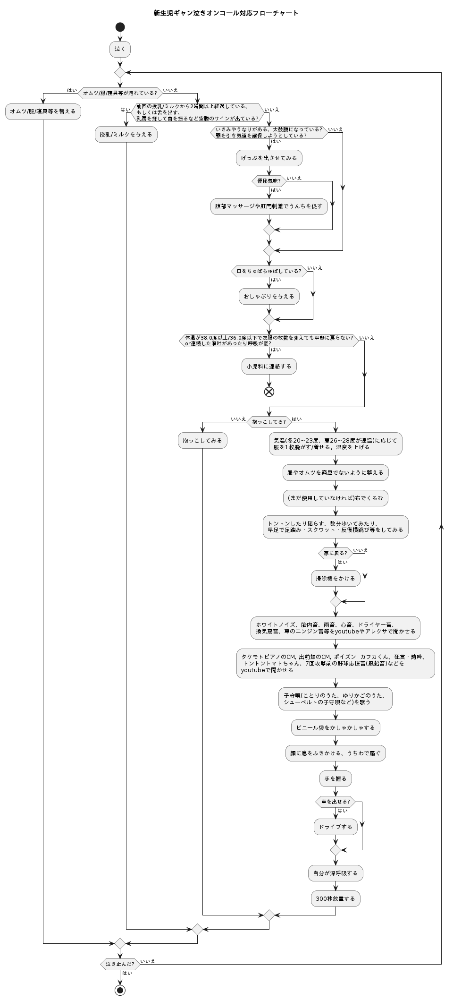

新生児ギャン泣きオンコール対応者向けのプレイブックです。

このフローチャートは医学的見地やデータに基づいたものではなく、作者が育児を通じて経験則的に得られた知識、SNS上で寄せられたご意見などを参考に作られた簡易的なものです。
異常を感じたら、近くの小児科や[小児救急電話相談](http://kodomo-qq.jp/index.php?pname=n8000#:~:text=%E5%B0%8F%E5%85%90%E7%A7%91%E5%8C%BB%E5%B8%AB%E3%83%BB%E7%9C%8B%E8%AD%B7%E5%B8%AB%E3%81%8B%E3%82%89,%E3%81%AB%E8%87%AA%E5%8B%95%E8%BB%A2%E9%80%81%E3%81%95%E3%82%8C%E3%81%BE%E3%81%99%E3%80%82)に連絡することを躊躇しないでください。

#### きっかけ
[この投稿](https://twitter.com/akkie30/status/1773341405869400372)への反響が大きかったのでオープンソース化してみました。

#### 開発スポンサーの方へ
[ありがとうございます](https://www.amazon.jp/hz/wishlist/ls/1ZMR4CK2TJTNQ?ref_=wl_share)

#### License
MIT License